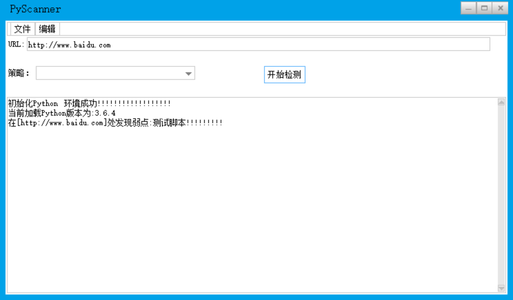

PyScanner
=============================

这是一个C++ 调用Python的Demo
程序总体样式如下:


程序界面主要采用采用炫彩UI库

该程序是一个简单的Demo，程序主要功能是调用Python模块对指定的url进行弱点扫描。

弱点的python代码文件放在 ./plugins下。
python代码中主要需要两个函数：
```python
getInformation()
```

```python
startScan(url, method)
```

getInformation 函数用来返回弱点的相关信息，主要是弱点名称和弱点的威胁登记

startScan 函数用于真正的扫描，函数有两个参数分别为需要扫描的url，和发包的方法
下面是一个完整的python脚本的例子:
```python
import requests

def getInformation():
    return "测试脚本", 1

def startScan(url, method):
    if(method == "GET"):
	    response = requests.get(url)
    else:
        response = requests.post(url)

    if response.status_code == 200:
        return True, url
    else:
        return False
```
返回值表示是否检测到了弱点，如果能检测到需要额外的带上弱点的url

## 目录结构
plugins: 存放对应的python代码
policy: 对应的扫描策略(这部分功能没有做)
skin: 皮肤库，目前只有最基础的界面元素
SysBtn: 按钮图片
PyScanner: 源码

## 说明
1. 这个项目只是一个简单的Demo，很多地方写的很粗糙。
2. 当初想了许多功能，但是由于时间关系和自己的能力问题，暂时还没有精力来完成它

## 后续计划
后续我希望将其作为一个实用的工具来进行开发，主要需要完成以下几个功能：
1. 完善策略这块，让用户能够决定哪些python扫描执行哪些不执行
2. 将之前的单线程扫描改成多线程，让不同的python 代码在不同的线程中执行
3. 添加扫描项目管理的功能，尽量支持多个url同时进行扫描
4. 修改界面，将界面做的好看点，不给炫彩这个界面库抹黑

## 参考资料：
1. [官方文档](https://docs.python.org/2/extending/embedding.html)
2. [浅析 C++ 调用 Python 模块](https://blog.csdn.net/tobacco5648/article/details/50890106)
3. [PyArg_ParseTuple 格式化](https://docs.python.org/release/1.5.2p2/ext/parseTuple.html)
4. [炫彩界面库](http://www.xcgui.com/)
